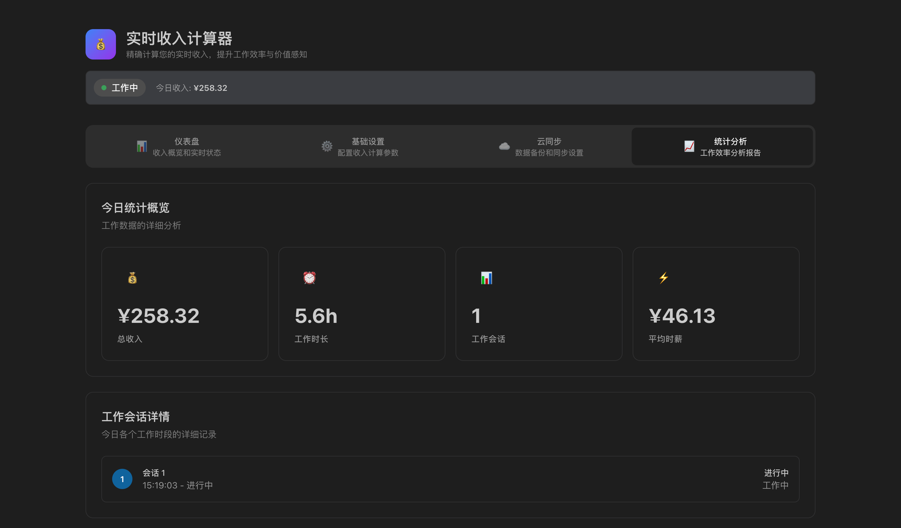
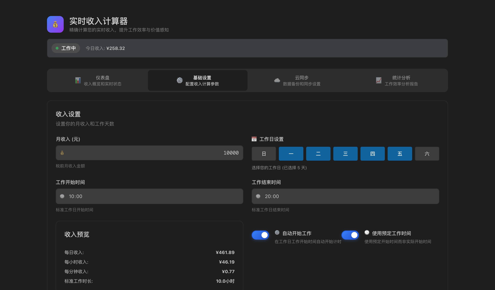
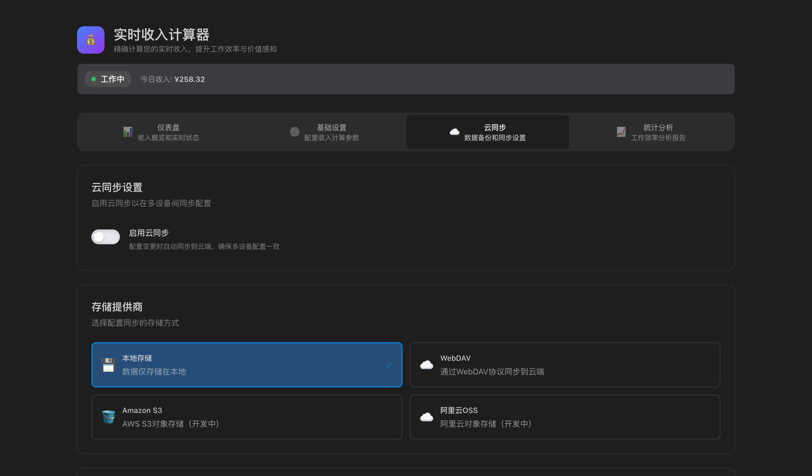
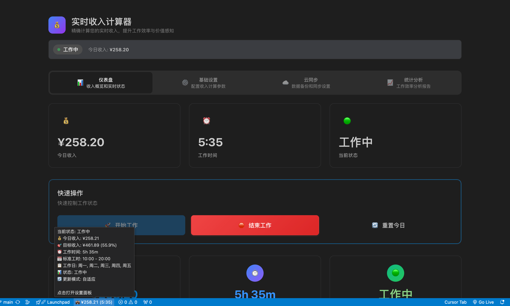

# 💼 实时收入计算器 - VSCode 扩展

一个强大的 VSCode 扩展，帮助您实时计算今日收入，提升工作效率与价值感知。

## 📸 效果展示

<div align="center">
  
  <p>仪表盘界面</p>
</div>

<div align="center" style="display: flex; justify-content: space-between; flex-wrap: wrap; margin-top: 20px;">
  <div style="flex: 1; min-width: 300px; margin: 10px;">
    
    <p>基础设置界面</p>
  </div>
  <div style="flex: 1; min-width: 300px; margin: 10px;">
    
    <p>云同步设置界面</p>
  </div>
</div>

<div align="center">
  
  <p>状态栏显示效果</p>
</div>

## ✨ 功能特色

- 📊 **实时收入计算** - 基于工作时长自动计算今日收入
- ⚙️ **灵活配置** - 月收入、工作时间、精度等参数可调
- 💪 **加班工资** - 支持加班倍率计算
- 📱 **隐私模式** - 可隐藏状态栏收入，保护隐私
- ☁️ **云同步** - 支持 WebDAV、S3、阿里云 OSS 等多种云存储
- 📈 **统计分析** - 详细的工作效率分析和趋势图表
- 🎨 **现代化界面** - 美观的设计，完美适配 VSCode 主题

## 🚀 快速开始

### 安装方式

1. **从 VSCode 应用商店安装**（推荐）
   - 在 VSCode 中搜索 "实时收入计算器"
   - 点击安装即可

2. **手动安装开发版**
   ```bash
   git clone https://github.com/zhiyingzzhou/daily-income-tracker
   cd daily-income-tracker
   npm install
   npm run build-webview
   npm run compile
   ```

### 基本使用

1. **打开设置面板**
   - 按 `Cmd/Ctrl + Shift + P`
   - 输入 "实时收入计算器: 打开收入设置"

2. **配置基本信息**
   - 设置月收入、工作天数
   - 配置工作时间和精度

3. **开始工作**
   - 点击 "开始工作" 或使用命令
   - 查看状态栏实时收入显示

## 🛠️ 开发指南

### 环境要求

- Node.js 16+
- npm 或 yarn
- VSCode 1.74.0+

### 快速开发启动 ⚡

我们提供了便捷的一键启动脚本：

```bash
# 🎯 一键启动开发模式（推荐）
npm run dev

# 🐧 Linux/macOS 用户也可以使用
npm run dev:sh

# 🪟 Windows PowerShell 用户
npm run dev:win
```

**开发脚本会自动：**

- ✅ 检查项目依赖
- 🧹 清理输出目录
- 🔧 启动 TypeScript 监听编译
- ⚛️ 启动 React/CSS 监听构建
- 📊 实时显示编译状态
- 🎨 彩色输出和进度提示

启动后：

1. 按 `F5` 启动调试
2. 在新窗口测试扩展
3. 修改代码自动重新编译
4. 按 `Ctrl+C` 退出开发模式

### 手动开发流程

如果需要手动控制，可以分别运行：

```bash
# 终端 1: TypeScript 监听编译
npm run watch

# 终端 2: React/CSS 监听构建
npm run dev-webview

# 然后在 VSCode 中按 F5 启动调试
```

### 项目结构

```
daily-income-tracker/
├── src/
│   ├── core/                 # 核心业务逻辑
│   │   ├── IncomeCalculator.ts
│   │   ├── StatusBarManager.ts
│   │   ├── SyncManager.ts
│   │   ├── ConfigManager.ts
│   │   ├── Utils.ts
│   │   └── constants.ts
│   ├── webview/              # React 前端
│   │   ├── components/       # UI 组件
│   │   ├── styles/          # 样式文件
│   │   └── types.ts         # 类型定义
│   └── extension.ts         # 扩展入口
├── scripts/                 # 开发脚本
│   ├── dev.js              # Node.js 开发脚本
│   ├── dev.sh              # Bash 开发脚本
│   ├── dev.ps1             # PowerShell 开发脚本
│   └── build.js            # 构建脚本
└── .vscode/                # VSCode 配置
    ├── launch.json         # 调试配置
    └── tasks.json          # 任务配置
```

### 构建命令

```bash
# 🏗️ 生产构建
npm run build               # 一键生产构建（推荐）
# 或手动分步构建
npm run compile             # 仅编译 TypeScript
npm run build-webview      # 仅构建 React 前端

# 🧪 测试和检查
npm run lint                # ESLint 检查
npm run format              # 格式化代码
npm run test                # 运行测试

# 📦 发布准备
npm run package-extension   # 打包扩展
npm run package             # 创建 VSIX 安装包
npm run vscode:prepublish   # 发布前编译
```

### 调试技巧

1. **扩展调试**
   - 在 `src/extension.ts` 设置断点
   - 使用 `console.log` 输出调试信息

2. **WebView 调试**
   - 在调试窗口按 `Cmd/Ctrl + Shift + I`
   - 使用浏览器开发者工具调试 React 组件

3. **查看日志**
   - 在调试窗口：`View > Output`
   - 选择 "Log (Extension Host)"

## 📋 配置选项

| 配置项                              | 说明                         | 默认值      |
| ---------------------------------- | ---------------------------- | ----------- |
| `dailyIncome.monthlyIncome`        | 月收入（元）                  | 10000       |
| `dailyIncome.workDays`             | 工作日设置（数组）            | [1,2,3,4,5] |
| `dailyIncome.autoStartWork`        | 自动开始工作                  | false       |
| `dailyIncome.useScheduledWorkTime` | 使用预定工作时间              | false       |
| `dailyIncome.workStartTime`        | 工作开始时间                  | 09:00       |
| `dailyIncome.workEndTime`          | 工作结束时间                  | 18:00       |
| `dailyIncome.precisionLevel`       | 显示精度（小数位）            | 2           |
| `dailyIncome.overtimeEnabled`      | 启用加班工资                  | true        |
| `dailyIncome.overtimeRate`         | 加班工资倍率                  | 1.5         |
| `dailyIncome.deductForEarlyLeave`  | 早退扣费                      | false       |
| `dailyIncome.autoSync`             | 启用云同步                    | false       |
| `dailyIncome.syncProvider`         | 同步提供商                    | local       |
| `dailyIncome.updateFrequency`      | 更新频率                      | auto        |
| `dailyIncome.blurStatusBarIncome`  | 隐私模式（隐藏状态栏收入）     | false       |

## 🎯 使用示例

### 基础场景

```
月收入: 15000 元
工作日: 周一至周五 (5天/周)
工作时间: 09:00-18:00
今日工作: 8.5 小时
实时收入: ¥731.25
```

### 加班场景

```
正常工作: 8 小时 → ¥681.82
加班工作: 2 小时 × 1.5 倍率 → ¥255.68
今日总收入: ¥937.50
```

### 隐私模式

```
开启 dailyIncome.blurStatusBarIncome 配置
状态栏显示：💼 👁️ (2:30)  // 只显示工作时间，不显示收入
```

## ☁️ 云同步配置

### WebDAV 配置

```json
{
  "provider": "webdav",
  "endpoint": "https://your-webdav-server.com",
  "username": "your-username",
  "password": "your-password"
}
```

### Amazon S3 配置

```json
{
  "provider": "s3",
  "endpoint": "s3.amazonaws.com",
  "accessKey": "your-access-key",
  "secretKey": "your-secret-key",
  "bucket": "your-bucket-name"
}
```

### 阿里云 OSS 配置

```json
{
  "provider": "aliyun-oss",
  "endpoint": "oss-cn-hangzhou.aliyuncs.com",
  "accessKey": "your-access-key",
  "secretKey": "your-secret-key",
  "bucket": "your-bucket-name"
}
```

## 🤝 贡献指南

我们欢迎所有形式的贡献！

### 提交问题

- 使用 GitHub Issues 报告 Bug
- 详细描述问题和复现步骤
- 提供系统环境信息

### 提交代码

1. Fork 项目
2. 创建功能分支: `git checkout -b feature/amazing-feature`
3. 提交更改: `git commit -m 'feat: add amazing feature'`
4. 推送分支: `git push origin feature/amazing-feature`
5. 创建 Pull Request

### 开发规范

- 使用 TypeScript 严格模式
- 遵循 ESLint 和 Prettier 代码规范
- 编写详细的注释
- 添加单元测试

## 📄 开源协议

本项目基于 MIT 协议开源 - 查看 [LICENSE](LICENSE) 文件了解详情

## 🙏 致谢

- [VSCode Extension API](https://code.visualstudio.com/api)
- [React](https://reactjs.org/)
- [TypeScript](https://www.typescriptlang.org/)
- [Tailwind CSS](https://tailwindcss.com/)

## 📞 联系我们

- 📧 邮箱: zhiyingzzhou@gmail.com
- 🐛 问题反馈: [GitHub Issues](https://github.com/zhiyingzzhou/daily-income-tracker/issues)

---

**⭐ 如果这个项目对您有帮助，请给我们一个 Star！**
